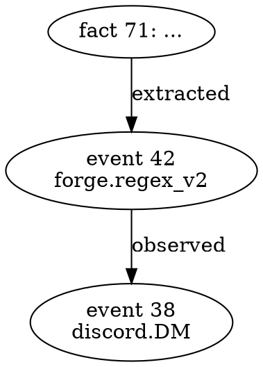

# REST API reference

> **Status:** v1.1.1 (P0 ACL fix + SQLite thread safety).
> 18 endpoints total — 11 v1.1.0 base + 7 opt3-6 (merge dedup v2, provenance, versioning, restore).

Base URL: `http://127.0.0.1:7803` (default). The CLI subcommand
`am serve` and the legacy `restart.py` daemon both bind to this port.

For all POST endpoints, send `Content-Type: application/json`.

---

## Table of contents

1. [ACL: actor / role resolution](#acl-actor--role-resolution)
2. [Core write / read](#core-write--read)
   - [`POST /v1/write`](#post-v1write)
   - [`POST /v1/read`](#post-v1read)
   - [`POST /v1/forget`](#post-v1forget) — **opt3-6 (forget + dry-run + audit snapshot)**
   - [`POST /v1/read/multi`](#post-v1readmulti) — **opt3-6 (cross-tier parallel recall)**
3. [Auto-link (v1.2.3)](#auto-link-v123--2026-08-16) — *(Zettelkasten auto-link edges at write)*
4. [Cascade write queue](#cascade-write-queue-v120--2026-08-16) — *(v1.2.0 — durable embed failure queue)*
5. [Lifecycle: dedup + merge](#lifecycle-dedup--merge)
   - [`POST /v1/merge/find`](#post-v1mergefind) — **opt3-6 (cosine + LLM judge)**
   - [`POST /v1/merge/apply`](#post-v1mergeapply) — **opt3-6 (apply reviewed merges)**
6. [Provenance graph (fact lineage)](#provenance-graph-fact-lineage)
   - [`GET /v1/fact/<id>/provenance`](#get-v1factidprovenance) — **opt3-6**
   - [`GET /v1/fact/<id>/lineage`](#get-v1factidlineage) — **opt3-6**
   - [`GET /v1/fact/<id>/graph.dot`](#get-v1factidgraphdot) — **opt3-6 (graphviz)**
   - [`POST /v1/fact/<id>/provenance`](#post-v1factidprovenance) — **opt3-6 (record parents)**
7. [Versioning + restore](#versioning--restore)
   - [`GET /v1/fact/<id>/versions`](#get-v1factidversions) — **opt3-6**
   - [`POST /v1/fact/<id>/restore`](#post-v1factidrestore) — **opt3-6**
   - [`GET /v1/snapshot/stats`](#get-v1snapshotstats) — **opt3-6 (daily snapshot stats)**
8. [Stats + health](#stats--health)
   - [`GET /v1/health`](#get-v1health)
   - [`GET /v1/viewer/stats`](#get-v1viewerstats) — v1.1.0 (MemoraX Viewer)
   - [`GET /v1/lex/stats`](#get-v1lexstats)
9. [Admin + installer](#admin--installer)
   - [`POST /v1/reload`](#post-v1reload) — first_admin only
   - [`POST /v1/install`](#post-v1install)

---

## ACL: actor / role resolution

Every POST endpoint routes through `before_request`, which resolves the
caller's `(actor, role)` from `bot-binding.db user_meta.role`. See
[`architecture.md`](./architecture.md) § "ACL enforcement flow" for the
full pipeline. The relevant body fields per request:

| Field | Required | Notes |
|---|---|---|
| `user` | always | The caller. Resolves to actor+role via `user_meta.role`. `admin` alias → `first_admin`. Unknown users → fail-closed as `first_admin` (with audit row). |
| `tier` | optional | `public` (default), `source`, `private`, `repo`. |
| `user_id` | when cross-user | For `tier=private`: filters which user's DB. Defaults to `user`. Cross-user reads require admin role; user role gets `403 cross_user_forbidden`. |
| `repo_id` | when `tier=repo` | Hash of the git remote URL. See CHANGELOG v1.1.0. |

**Error responses for ACL failures**:

| Status | `error` | Meaning |
|---|---|---|
| 403 | `permission_denied` | `astor_check_*` from downstream code raised (e.g. user → source tier) |
| 403 | `cross_user_forbidden` | Cross-user access attempted by a `user` role |
| 403 | `acl_init_failed` | `astor_init_acl` itself failed (bad tier / missing user_id for private) |

---

## Core write / read

### `POST /v1/write`

Write a fact through `bus` (canonical store) + `forge` (extraction) +
`nest` (embedding). The `mode` parameter controls extraction cost:

- `auto` (default): regex for short text (<200 chars), raw `none` for long
  bulk paste — zero LLM cost on average
- `regex`: pure regex, zero LLM
- `none`: skip extraction entirely, write raw text
- `llm`: opt-in to LLM extraction (cost = ~$0.001/call)

**Body**

| Field | Required | Default | Notes |
|---|---|---|---|
| `text` | yes | — | The fact to remember |
| `user` | no | `admin` | Caller id (resolves role from user_meta) |
| `mode` | no | `auto` | Extraction mode (see above) |
| `tier` | no | `public` | `public`/`source`/`private`/`repo` |
| `scope` | no | `long_term` | `long_term`/`short_term`/`profile`. `profile` auto-routes to `private`. |
| `user_id` | when private | `user` | Target user (cross-user requires admin) |
| `repo_id` | when `tier=repo` | — | Per-repo isolation (MemoraX pattern) |
| `mirror_to_source` | no | `false` | Admin-only. If `tier=public` + `true`, also writes to `source` tier |

**Response 200**

```json
{
  "fact_ids": [123],
  "count": 1,
  "event_id": 4567,
  "scope": "long_term",
  "tier": "public",
  "mirrored": []
}
```

**Errors**: `400 text required`, `400 invalid scope`, `400 tier=repo requires repo_id`,
`403 permission_denied` (user → source tier), `403 acl_init_failed`.

---

### `POST /v1/read`

Recall similar facts via hybrid vector + BM25 search.

**Body**

| Field | Required | Default | Notes |
|---|---|---|---|
| `query` | yes | — | Free-form query string |
| `top_k` | no | 5 | Number of results |
| `tier` | no | `public` | Recall target tier |
| `user_id` | when private | `user` | Filter to one user's private DB |
| `hybrid` | no | `true` | Use both vector (60%) + BM25 (40%); set `false` for pure vector |
| `bm25_weight` | no | 0.4 | Override hybrid weight |
| `vec_weight` | no | 0.6 | Override hybrid weight |

**Response 200**

```json
{
  "count": 3,
  "results": [
    {
      "fact_id": 359,
      "content": "...",
      "kind": "system_event",
      "namespace": "/tenant/admin/actor/discord:.../project/...",
      "user_id": "admin",
      "similarity": 0.85,
      "score_kind": "hybrid",
      "confidence": 0.9,
      "importance": 0.85,
      "tags": null,
      # v1.2.1: structured fields (A-MEM pattern). Empty defaults for
      # pre-v1.2.1 facts. `keywords` is a JSON array of 3-7 keywords
      # extracted at write time (LLM or regex). `context` is a 1-2 sentence
      # summary. The keyword Jaccard boost in hybrid_merge uses these to
      # improve ranking when embeddings miss keyword-level intent.
      "keywords": ["coffee", "dark-roast", "preference"],
      "context": "User stated preference for dark roast coffee over light."
    }
  ]
}
```

**v1.2.1 — keyword rerank**: When `hybrid=true` (default), the server
loads `keywords` from each candidate canonical row + tokenizes the
query, then passes both into `hybrid_merge`. The score becomes:

```
score = bm25_weight * bm25_normalized
      + vec_weight * cosine
      + keyword_boost * Jaccard(fact_keywords, query_keywords)
```

`keyword_boost` defaults to 0.15. The boost is bounded (Jaccard in [0,1]).
When neither fact has keywords, behavior is byte-identical to legacy
hybrid (the boost contributes 0).

---

### `POST /v1/forget`  *(opt3-6)*

Forget a fact by ID or by content match. Always writes a `forget` row
to `bus.audit_log` with the full `old_state` snapshot (for opt6
versioning / undo). Supports **dry-run** to preview what would happen.

**Body — one of two modes**

```jsonc
// Mode 1: explicit fact_id
{
  "user": "admin",
  "tier": "private",
  "fact_id": 123,
  "tombstone_only": true,   // false = hard-delete (also wipes embeddings)
  "dry_run": false           // true = no mutation, just preview
}

// Mode 2: content match (BM25 best-hit)
{
  "user": "admin",
  "tier": "private",
  "user_id": "alice",
  "query": "user mentioned she prefers tea",
  "forget_threshold": 5.0,   // BM25 min score to act on
  "tombstone_only": false,
  "dry_run": false
}
```

**Strategy**

1. If `fact_id` given: look up fact, tombstone via `bus`, remove from
   `lex` (soft or hard depending on `tombstone_only`).
2. If `query` given: BM25 search in `(tier, user_id)`; pick top-1; if
   score ≥ `forget_threshold` (default 5.0), forget it. Otherwise
   return empty hit + candidate list.
3. Always log to `bus.audit_log` with `old_state` JSON snapshot (opt6
   versioning).
4. `dry_run=true` returns the preview without mutating.

**Response 200**

```json
// Normal:
{
  "forgotten": [
    {"fact_id": 123, "score": 1.0, "content_preview": "...", "tombstone_only": true}
  ]
}

// Dry run:
{
  "dry_run": true,
  "would_forget": [
    {"fact_id": 123, "score": 0.96, "content_preview": "...",
     "tombstone_only": false, "tier": "private", "user_id": "alice"}
  ],
  "note": "No mutation was performed."
}

// BM25 below threshold:
{
  "forgotten": [],
  "reason": "best BM25 score 2.14 below threshold 5.0",
  "candidates": [{"fact_id": 88, "score": 2.14}, {"fact_id": 91, "score": 1.8}]
}
```

**Errors**: `400 fact_id or query required`, `404 fact_id N not found`,
`403 permission_denied`, `500 bus tombstone/delete failed`.

**Tombstone vs hard-delete**:
- `tombstone_only: true` → row stays in `bus.memory_canonical` with
  `tombstoned=1`. Recalls skip it but you can `/v1/fact/<id>/restore`
  it. Embeddings preserved.
- `tombstone_only: false` (default) → row hard-deleted from `bus`,
  `nest`, `lex`. Cannot be restored. Use for GDPR / right-to-be-forgotten.

---

### `POST /v1/read/multi`  *(opt3-6)*

Cross-tier parallel recall. Runs the same query against multiple
`(tier, user_id)` scopes in parallel, re-ranks by combined score, and
returns a single merged list. The primary recall path for callers whose
identity spans both `public` (agent's shared knowledge) and
`private_<self>`.

**Body**

```jsonc
{
  "query": "user preferences",
  "top_k": 10,
  "hybrid": true,
  "scopes": [
    {"tier": "public", "user_id": null, "weight": 0.5},
    {"tier": "private", "user_id": "alice", "weight": 1.0}
    // omit `scopes` to use default (public 0.5 + private/<caller> 1.0)
  ]
}
```

**Response 200**

```json
{
  "count": 7,
  "results": [
    {"fact_id": 359, "score": 0.92, "tier": "private", "user_id": "alice", ...},
    {"fact_id": 12,  "score": 0.71, "tier": "public",  "user_id": null,   ...}
  ]
}
```

Z-score normalization is applied per scope before merging, so heavier
weights can pull up lower-ranked hits in their scope.

---

## Reflection orchestrator  *(v1.2.2 — 2026-08-16)*

Episodic consolidation pipeline (EverOS `memory/reflection/` pattern,
simplified for astor's SQLite stack). Finds clusters of similar
canonical facts in a tier, merges them into a single winner, and
tombstones losers. Frees recall from noisy duplicates + reduces audit
trail bloat.

### `POST /v1/reflection/run`  *(v1.2.2)*

Run the reflection pipeline. **First_admin only** — destructive
(can rewrite many rows at once).

**Body**


**Response 200**


**Pipeline** (Select → Merge → Deprecate):
1. **Select** — group facts by (kind, scope_type); cluster facts sharing
   ≥3 distinctive tokens (length ratio ≤ 2x as sanity check).
2. **Merge** — for each cluster, pick the winner (highest importance,
   then most recent, then highest confidence, then lowest id); compose
   merged content by joining distinct member content with `
---
`.
3. **Deprecate** — tombstone all losers (`tombstoned=1`); write audit row
   per deprecation with full `old_state` JSON.

**Errors**: `403 reflection_run requires first_admin`.

**Idempotency**: second run returns 0 clusters (losers are tombstoned
and filtered out by the SQL query). Safe to invoke weekly via cron.

### When to use

- **Weekly cron**: `am reflection run --tier=public --max-clusters=200` on
  Sunday 03:00 UTC (evergreen; keeps public tier tidy).
- **Post-migration**: after importing legacy data, run once per tier to
  collapse near-duplicates.
- **Per-tier blast control**: run public, source, admin separately.

### CLI equivalent


### Retrieval impact

Losers are NOT deleted; they remain queryable via
`/v1/fact/<id>/provenance` for audit purposes but drop out of standard
recall (`/v1/read` filters `tombstoned=0`). You can restore a loser
later via the existing `/v1/fact/<id>/restore` endpoint if needed.

---

## Auto-link (v1.2.3 — 2026-08-16)

Zettelkasten-style provenance-edge insertion (A-MEM pattern). After every
successful `POST /v1/write` (and the source-mirror path), the server
runs an auto-link pass on the new fact: it computes the embedding,
scans up to 200 existing facts of the same `kind` in the same tier,
and adds bidirectional provenance edges to any with cosine > 0.85.

**Audit-safe**: never rewrites existing facts — only adds edges to the
provenance graph.

### How it works (per write)

1. New fact N is promoted. Embedding already computed by `nest.store`.
2. Server scans `nest.search(embedding, limit=200)` for existing facts.
3. Filter: same `kind` + cosine > 0.85 + exclude self.
4. For each match M_i, append the edge in BOTH directions:
   - `M_i.parent_fact_ids` += `[N]`
   - `N.parent_fact_ids` += `[M_i]`
   - Both rows get `provenance_kind='auto_link'` + `provenance_agent='nest.auto_link'`.
5. Single audit row written per run (event=‘auto_link’) with `linked_to` list.

**Default threshold**: 0.85. **Max links per fact**: 5. **Failure mode**:
auto-link exceptions are caught and logged to stderr; the write
succeeds regardless.

### Querying auto-link edges

Use the existing provenance endpoints — they now surface auto-link edges:

```bash
# Get all ancestors (incl. auto-link) of fact 359
curl -X POST http://127.0.0.1:7803/v1/fact/359/provenance     -H "Content-Type: application/json" -d '{"tier": "public"}' | jq

# Get all descendants (incl. auto-link) of fact 359
curl -X POST http://127.0.0.1:7803/v1/fact/359/lineage     -H "Content-Type: application/json" -d '{"tier": "public"}' | jq
```

The rendered `provenance_kind` field tells you whether an edge is
`auto_link` (cosine match) vs `extracted` (rule-driven) vs `merged`
(reflection).

### Backfill existing facts

For one-shot population of edges between existing facts:

```bash
am auto-link backfill --tier public --limit 500 --cosine-threshold 0.85
```

This processes the most recent 500 non-tombstoned facts in the public
tier and runs auto-link for each. Idempotent — re-running finds 0
new edges because existing parent_fact_ids already contain the
discoveries.

### CLI flags

```bash
am auto-link backfill [--tier=public] [--user-id=...] [--limit=N]
                     [--cosine-threshold=0.85] [--max-links-per-fact=5]
```

### Performance

- **Per-write**: +1 nest.search (200 candidates) + up to 5 UPDATE
  pairs. Adds ~50-200ms to a write.
- **Backfill**: O(N) per fact in the limit. cron it weekly:
  `am auto-link backfill --tier=public --limit=500` on Sun 04:00 UTC.

### When to disable

If you want zero auto-link overhead per write, set the threshold
high (> 0.95) or pass `--max-links-per-fact=0` in the backfill
(one-time disable). The write-path auto-link is unconditional in v1.2.3.

---

## Cascade write queue  *(v1.2.0 — 2026-08-16)*

Durable queue for failed embed writes. When `nest.store()` fails inside
`promote_candidate` (e.g. embedding model OOM, fastembed import error,
LanceDB unavailable), the fact + content + tier + user_id are queued
here for replay. Without this, the fact lived forever with no
embedding and recall returned empty for it. Pattern from EverOS
`md_change_state` (simplified for astor's SQLite-only stack).

### `POST /v1/cascade/replay`  *(v1.2.0)*

Drain pending cascade rows. **First_admin only** — this is a
destructive operation (can write to many nest DBs at once).

**Body**

```json
{
  "limit": 100,            // max rows to process (default 100)
  "max_attempts": 5        // per-row max retry count (default 5)
}
```

**Response 200**

```json
{
  "processed": 5,
  "succeeded": 4,
  "failed": 1,
  "still_pending": 0,
  "results": [
    {"ok": true,  "row_id": 17, "fact_id": 359, "operation": "embed_insert",
     "status": "succeeded", "attempt_count": 1},
    {"ok": false, "row_id": 18, "fact_id": 360, "operation": "embed_insert",
     "status": "failed", "attempt_count": 5, "error": "embed model still down"}
  ]
}
```

**Row state machine**: `pending → succeeded` (embed succeeded on retry)
or `pending → failed` (still failing after `max_attempts` retries; row
kept for post-mortem, cleared by `am cascade purge`). Pending rows
that fail but haven't hit max_attempts stay as `pending` for the next
replay pass.

**Errors**: `403 cascade_replay requires first_admin`.

### `GET /v1/cascade/stats`  *(v1.2.0)*

Aggregate stats: counts by status + last_attempt_at.

**Response 200**

```json
{
  "pending": 3,
  "succeeded": 42,
  "failed": 1,
  "last_attempt_at": "2026-08-16T10:15:42.123Z"
}
```

### CLI equivalents

```bash
# Same as POST /v1/cascade/replay
am cascade replay [--limit=N] [--max-attempts=N]

# Same as GET /v1/cascade/stats
am cascade stats

# Delete old rows (default: succeeded older than 7 days)
am cascade purge [--status=succeeded|failed|pending] [--older-than-days=N]
```

### When to replay

- After server restart (any pending rows from previous crashes)
- After fixing the underlying cause (e.g. embedding model OOM resolved)
- Via cron: `am cascade replay --limit=50` daily 03:30 MDT drains any
  backlog that built up overnight (set up separately — not auto-run
  in v1.2.0)

### Failure modes that route to the queue

| Failure | Routes? | Reason |
|---|---|---|
| Embedding model not loaded (lazy load failed first time) | ✓ | Transient — retry on next replay |
| OOM during batched embed | ✓ | Transient — retry when memory freed |
| SQLite disk full / I/O error | ✓ | Transient — retry once disk freed |
| fastembed / numpy version mismatch | ✓ (with care) | May or may not succeed; `max_attempts` prevents loop |
| ACL permission denied | ✗ | Caller sees 403 — wrong layer |
| Schema corruption | ✗ | Loud failure + audit row, manual fix |
| Schema version mismatch | ✗ | Loud failure — server must migrate |

---

## Lifecycle: dedup + merge

### `POST /v1/merge/find`  *(opt3-6)*

Find candidate duplicate fact groups using cosine similarity + optional
LLM judge. `first_admin` only (matrix decision — merge is a destructive
operation).

**Body**

| Field | Required | Default | Notes |
|---|---|---|---|
| `tier` | no | `public` | Scope of the search |
| `user_id` | when private | — | Filter to one user |
| `threshold` | no | 0.92 | Cosine similarity threshold |
| `top_k` | no | 50 | Max candidates to consider |
| `use_llm` | no | `true` | LLM judge to confirm duplicates (vs near-miss paraphrases) |
| `max_groups` | no | 100 | Max groups to return |

**Response 200**

```json
{
  "tier": "public",
  "user_id": null,
  "candidate_count": 50,
  "group_count": 3,
  "groups": [
    {
      "group_id": 0,
      "size": 3,
      "method": "cosine+llm",
      "suggested_winner": 359,
      "losers": [360, 361],
      "llm_verdicts": [{"pair": [359, 360], "verdict": "duplicate", "confidence": 0.94}]
    }
  ],
  "threshold": 0.92,
  "top_k": 50,
  "use_llm": true
}
```

The `groups` are slim — embedding vectors stripped. Use the returned
`group_id` + `losers` to construct a merge list for `/v1/merge/apply`.

**Errors**: `403 merge requires first_admin`.

---

### `POST /v1/merge/apply`  *(opt3-6)*

Apply a reviewed merge list. `first_admin` only. Each entry picks a
winner and lists losers to fold into it. Writes a `merge_apply` row to
`bus.audit_log` per group.

**Body**

```jsonc
{
  "merges": [
    {
      "winner": 359,
      "losers": [360, 361],
      "method": "cosine+llm"   // for audit
    }
  ],
  "actor": "merge_v2_operator"
}
```

**Response 200**

```json
{
  "applied": 1,
  "merged_groups": [{"winner": 359, "losers": [360, 361], "audit_id": 102}],
  "audit": "merge_apply rows written to bus.audit_log"
}
```

---

## Provenance graph (fact lineage)

Each fact can have parent facts that contributed to its existence
(extracted-from-conversation, derived-from-fact, etc.). The provenance
graph traces these links for audit and explainability.

### `GET /v1/fact/<id>/provenance`  *(opt3-6)*

Get the full ancestry tree (parents → grandparents → ...) for a fact.

**Query params**

| Param | Default | Notes |
|---|---|---|
| `tier` | `public` | Which tier DB to read |
| `user_id` | — | Filter when `tier=private` |
| `max_depth` | 8 | Stop at this ancestor depth |

**Response 200**

```json
{
  "fact_id": 71,
  "nodes": [
    {"id": 71, "kind": "fact", "content_preview": "...", "depth": 0, "agent": "user"},
    {"id": 42, "kind": "event", "depth": 1, "agent": "forge.regex_v2"},
    {"id": 38, "kind": "event", "depth": 2, "agent": "discord.DM"}
  ],
  "edges": [
    {"from": 71, "to": 42, "kind": "extracted"},
    {"from": 42, "to": 38, "kind": "observed"}
  ],
  "max_depth_reached": 2
}
```

---

### `GET /v1/fact/<id>/lineage`  *(opt3-6)*

Get the **descendant** tree (children, grandchildren, ...). Useful for
"what did this conversation produce?" queries.

Same params/response shape as `/provenance`, just the direction is
flipped.

---

### `GET /v1/fact/<id>/graph.dot`  *(opt3-6)*

Render the provenance graph as **Graphviz DOT** for visual inspection.
Pipe through `dot -Tpng` to get a PNG.

**Query params**

| Param | Default | Notes |
|---|---|---|
| `direction` | `both` | `up` (parents), `down` (children), `both` |
| `tier`, `user_id`, `max_depth` | — | Same as `/provenance` |

**Response 200** with `Content-Type: text/vnd.graphviz`:



**Errors**: `404` if `fact_id` doesn't exist in that tier.

---

### `POST /v1/fact/<id>/provenance`  *(opt3-6)*

Record a new provenance edge. Useful when a tool / skill wants to
declare "I derived fact X from facts A and B".

**Body**

```json
{
  "parents": [42, 38],
  "kind": "extracted",      // free-form: extracted, derived, merged, observed, ...
  "agent": "forge.regex_v2",
  "depth": 1,                // optional override
  "tier": "public",
  "user_id": null
}
```

**Response 200**

```json
{"recorded": 1, "edges_added": 2, "audit_id": 89}
```

---

## Versioning + restore

### `GET /v1/fact/<id>/versions`  *(opt3-6)*

List all stored versions of a fact (snapshots taken at each write /
forget / restore event). Useful for "what did this fact used to say?"

**Query params**: `tier` (default `public`), `user_id`.

**Response 200**

```json
{
  "fact_id": 71,
  "tier": "public",
  "user_id": null,
  "version_count": 3,
  "versions": [
    {
      "version": 3, "ts": "2026-08-16T...", "actor": "restore_v1",
      "target_state": "current", "reason": "restore from v1",
      "old_state": null
    },
    {
      "version": 2, "ts": "2026-08-15T...", "actor": "rest_api",
      "target_state": "current", "reason": "edit",
      "old_state": {"columns": {"content": "old text"}, "tier": "public"}
    }
  ]
}
```

`old_state` is the full JSON snapshot of the row before this version
became current.

---

### `POST /v1/fact/<id>/restore`  *(opt3-6)*

Restore a fact to a previous version, or preview what restore would do.
`first_admin` only.

**Body**

```json
{
  "tier": "public",
  "user_id": null,
  "target_state": "preview",   // or "current" to commit
  "actor": "restore_v1"
}
```

**Response 200** (preview)

```json
{
  "preview": true,
  "would_restore_from": {"version": 2, "content": "...", "ts": "..."},
  "current_state": {"content": "...", "ts": "..."},
  "diff": {"fields_changed": ["content", "confidence"]}
}
```

**Response 200** (commit)

```json
{
  "preview": false,
  "restored_to": {"version": 2, "content": "..."},
  "audit_id": 110,
  "new_version": 4
}
```

---

### `GET /v1/snapshot/stats`  *(opt3-6)*

Daily snapshot statistics — the events captured for that date with
severity + counts. Useful for "what happened yesterday?" dashboards.

**Query params**

| Param | Default | Notes |
|---|---|---|
| `date` | today (UTC) | `YYYY-MM-DD` |
| `tier` | `public` | Which tier DB |
| `user_id` | — | When `tier=private` |

**Response 200**

```json
{
  "date": "2026-08-16",
  "tier": "public",
  "user_id": null,
  "counts_by_event_severity": {
    "forget": {"warning": 22},
    "merge": {"warning": 9},
    "promote_idempotent_replay": {"info": 64},
    "restore": {"info": 1}
  },
  "sample": [
    {"audit_id": 96, "ts": "2026-08-16T...", "event": "forget",
     "actor": "rest_api", "severity": "warning", "target_id": "1"}
  ]
}
```

---

## Stats + health

### `GET /v1/health`

Health check + DB status. **Always 200** when server is up.

**Response 200**

```json
{
  "status": "ok",
  "version": "1.1.1",
  "astor_dir": "$ASTOR_DIR (e.g. /home/you/.astor)",
  "dbs": {
    "bus": "$ASTOR_DIR/public/memory/astor_bus_public.db",
    "nest": "$ASTOR_DIR/public/memory/astor_nest_public.db"
  },
  "facts": 866,
  "events": 86,
  "embeddings": 585
}
```

---

### `GET /v1/viewer/stats`  *(v1.1.0 — MemoraX Viewer)*

**Content-free** stats — counts only, NO fact content. Per MemoraX
architecture rule, the Viewer is a local projection, not memory
authority. Use for dashboards / health monitoring / writeback-status
without leaking PII.

**Response 200**

```json
{
  "version": "1.1.1",
  "astor_dir": "$ASTOR_DIR (e.g. /home/you/.astor)",
  "generated_at": "2026-08-16T...Z",
  "counts": {
    "facts_total": 6808,
    "facts_by_tier": {"public": 618, "source": 3080, "private": 3104, "repo": 6},
    "facts_by_scope": {"long_term": 6243, "short_term": 4, "profile": 5},
    "events_total": 3096,
    "embeddings_total": 6804,
    "candidates_total": 1260,
    "forge_audit_total": 6956,
    "dedup_hits_total": 64
  },
  "dbs": {
    "private/admin/bus": {"path": "...", "size_bytes": 11259904},
    "private/admin/nest": {"path": "...", "size_bytes": 12931072},
    ...
  },
  "last_activity_ts": "2026-08-16T...",
  "schema_versions": {...}
}
```

Scans all 9+ DBs (3 stores × 4 tiers) including N users and N repos.

---

### `GET /v1/lex/stats`

Per-tier BM25 (lex) index stats — document count, term count, tombstone
count.

**Response 200**

```json
{
  "private/admin": {"documents": 3104, "terms": 9197, "tombstoned": 0},
    "private/alice": {"documents": 8, "terms": 240, "tombstoned": 0},
  "public/_": {"documents": 5, "terms": 21, "tombstoned": 0},
  "source/_": {"documents": 12, "terms": 145, "tombstoned": 0},
  "version": 1
}
```

---

## Admin + installer

### `POST /v1/reload`

Re-exec the server process via `os.execv` so module caches pick up
fresh source without manual restart. **`first_admin` only** — verified
via `astor_check_bot_admin()`.

**Body**: empty.

**Response 200**

```json
{"reloaded": true, "pid": 39024}
```

Server process exits with status 0 after responding; the caller (or a
supervisor like NSSM / restart.py) brings up a new process with the
same port + ASTOR_DIR.

---

### `POST /v1/install`

Plan an install into another agent (Claude Code / Cline / Cursor / ...).
Returns file changes without writing them — review first, then apply.

**Body**

| Field | Required | Notes |
|---|---|---|
| `ide` | yes | `claude-code`, `cline`, `cursor`, etc. |
| `mode` | no | `priority` / `coexist` / `replace` / `verify` / `auto` |
| `agent_dir` | no | Agent home, default `~` |

**Response 200**

```json
{
  "plan": {
    "agent": "claude-code",
    "mode": "coexist",
    "tier": "C",
    "changes": [
      {"path": "~/.claude/instructions.md", "action": "append",
       "preview": "## Astor-Memory hook ..."}
    ],
    "notes": ["priority marker prepended to instructions.md"]
  }
}
```

See [`agent-adapters.md`](./agent-adapters.md) for the per-IDE install
contract.

---

## Versioning this reference

This document is updated alongside the code. If you find a mismatch:

1. Check `am --version` — should be ≥ 1.1.1
2. Compare against `astor_memory/server.py` @app.route decorators
3. File an issue with the actual vs documented behavior

The endpoint list above maps 1:1 to `@app.route(...)` decorators in
`server.py:152-1108` as of 2026-08-16.
